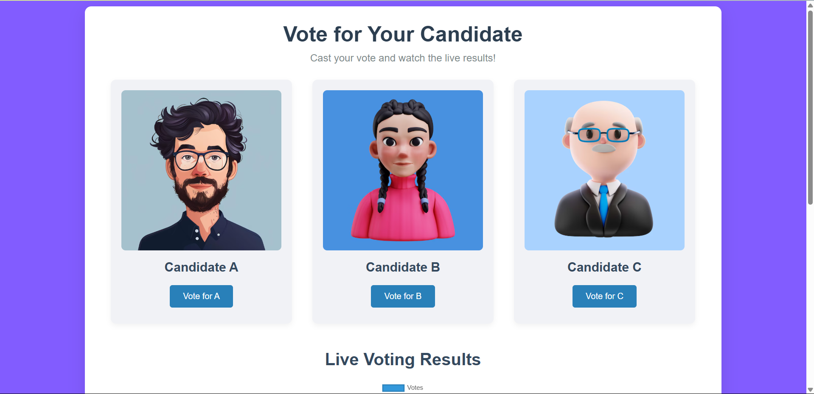
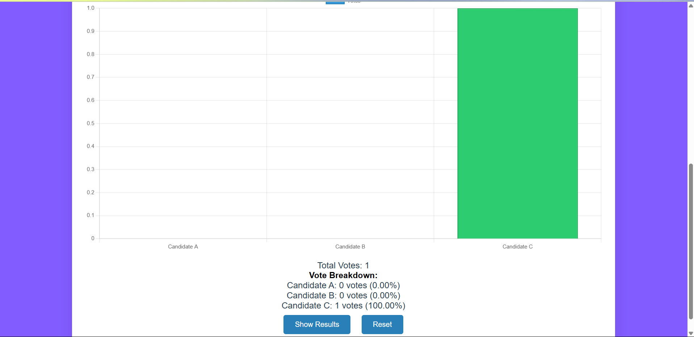
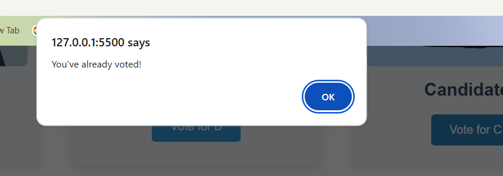

# 🗳️ Voting App

A simple and functional web-based Voting App built using [Html,Css,JavaScript]. This app allows users to vote for predefined options, view live vote counts, and ensures only one vote per user/session.

---

## 🚀 Features

- ✅ Real-time vote counting
- 🧑 One vote per user/session
- 📊 Result summary display
- 💡 Simple and clean UI

---

## 🛠️ Tech Stack

- HTML5
- CSS3
- JavaScript
- Node.js (optional if backend included)
- Express.js (if applicable)
- JSON or MongoDB (if you're storing votes)

---

## 📸 Screenshots

### 🧑‍💼 Voting UI  

### 🗳️ Live Voting Screen  

### ✅ Voting Done Confirmation  

### 🚀 Live Demo:

👉 [Click here to view](https://voting-app-amanmaner.netlify.app/)
